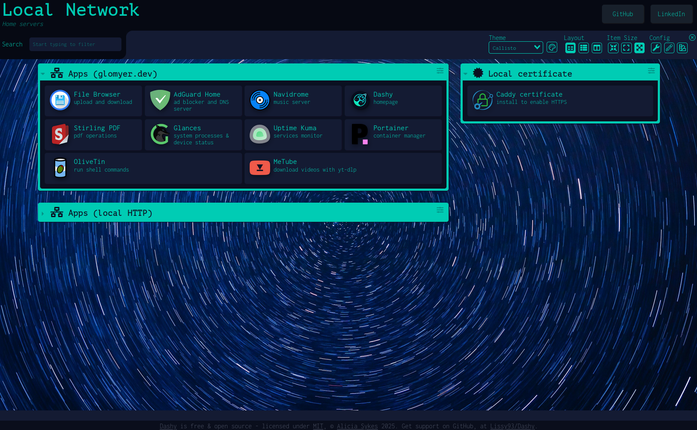

# homelab

This repository is my home server setup. I'm mainly using [Terraform](docs/terraform.md) to do provisioning and Ansible for configuration management. This repo uses Debian as the base OS, specifically version 12 (Bookworm). Most playbooks execute normally on Debian 13 (Trixie) but some give fails. APIs get deprecated, so there's no guarantees.

Currently I have two machines:
- a Raspberry Pi 4 running [Raspberry Pi OS](https://www.raspberrypi.com/software/)
- a repurposed i5 4440 with a Radeon RX 550 running VMs from [Proxmox](docs/proxmox.md)
  - One VM runs all my services
  - Another is a NAS powered by [Samba](/docs/services/samba.md)

Multiple services are defined using Ansible roles, most are containerized but there are host services as well.

## Homepage Dashboard



[Dashy](docs/dashy.md) serves as the central homepage and dashboard for accessing all homelab services. It provides:

- **Organized service links**: All services grouped into logical sections (HTTPS domains, local HTTP access, certificates)
- **Dual access methods**: Each service accessible via both secure HTTPS domains and direct local HTTP ports
- **Visual interface**: Clean, modern interface with service icons and descriptions
- **Quick access**: Single point of entry to navigate to any service in the homelab

The dashboard is automatically deployed via Ansible and includes links to all configured services. When adding new services, both the HTTPS (domain-based) and HTTP (direct port) access methods are added to maintain consistency and flexibility.

| Service                               | Description                                                  | Type      |
|---------------------------------------|--------------------------------------------------------------|-----------|
| [Adguard Home](docs/containers/adguard-home.md)  | Ad blocker & DNS resolver                         | Container |
| [Caddy](docs/services/caddy.md)                  | Reverse proxy and Certificate Authority           | Host      |
| [Dashy](docs/containers/dashy.md)                | Webpage for quick access to the network services  | Container |
| [File Browser](docs/containers/file-browser.md)  | Storage access from the browser                   | Container |
| [Glances](docs/containers/glances.md)            | System processes & device status monitor          | Container |
| [Navidrome](docs/containers/navidrome.md)        | Powerful music stream server                      | Container |
| [MeTube](docs/containers/metube.md)              | GUI for downloading videos with yt-dlp            | Container |
| [OliveTin](docs/services/olivetin.md)            | GUI for running shell commands                    | Host      |
| [Pi-hole](docs/containers/pihole.md)             | Ad blocker & DNS resolver                         | Container |
| [Portainer](docs/containers/portainer.md)        | Container management                              | Container |
| [Stirling PDF](docs/containers/stirling-pdf.md)  | Local operations on .pdf files                    | Container |
| [Uptime Kuma](docs/containers/uptime-kuma.md)    | Online services monitor                           | Container |
| [Vaultwarden](docs/containers/vaultwarden.md)    | Self-hosted Bitwarden compatible password manager | Container |
| [Vikunja](docs/containers/vikunja.md)            | Self-hosted to-do list and project management     | Container |

# Dependencies

Aside from Ansible, you might need some other software on your controller node (your machine).

- sshpass
- Ansible collections (install with `ansible-galaxy collection install [collection]`)
  - community.general
  - community.docker
  - ansible.posix
- [Ansible-lint](https://ansible.readthedocs.io/projects/lint/installing/#installing-the-latest-version)


## Ansible vault

Secrets are managed by Ansible vault. What needs to be done is the following:

- Make a copy of both [vault.yml.example](group_vars/all/vault.yml.example) and [vault_pass.txt.example](group_vars/all/vault_pass.txt.example)
- Remove .example from their filenames
- Put your vault password and secrets into the files
- Encrypt your vault with the following command:

```bash
ansible-vault encrypt group_vars/all/vault \
--vault-password-file group_vars/all/vault_pass.txt

# Or decrypt later when needed
ansible-vault decrypt group_vars/all/vault.yml \
--vault-password-file group_vars/all/vault_pass.txt
``` 


# Running the playbooks

There are multiple Ansible roles, one for each service and one named [extract_metadata](/roles/extract_metadata/tasks/main.yml) that lays the groundwork for setting up some needed variables, thus helping other roles. For simplicity containerized roles don't depend on Docker in their task files, so you must run the docker role at least once to ensure that Docker is properly installed. Aside from that, each role can be ran individually by using tags (configured as their own name).

Execution example:

```bash
ansible-playbook playbooks/create_template.yml \
--vault-password-file group_vars/all/vault_pass.txt

# If you didn't configure ssh keys you need to authenticate with credentials
# Tags usage bellow
ansible-playbook playbooks/main.yml \
--user pi \ 
--ask-pass \
--ask-become-pass \
--vault-password-file group_vars/all/vault_pass.txt \
--tags navidrome \ 
--skip-tags apt,docker

# Just copy your ssh key to the host, it's easier this way
ssh-copy-id -i ~/.ssh/id_ed25519.pub root@192.168.0.99
```

Some playbooks may set up things that are later used by other playbooks. Therefore, this is the recommended order to run:

- update_packages
- install_host_applications
- start_containers
- Any other playbooks


## Raspberry Pi server

Upon booting the Raspberry, run ```sudo raspi-config``` and enable VNC to allow remote GUIs through the network. I'm currently using RealVNC Viewer to access my server.


