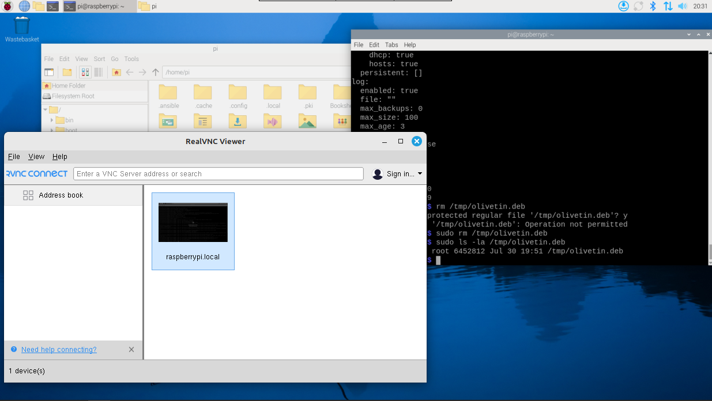

# homelab

This repository is my home server setup. I'm mainly using [Terraform](/docs/terraform.md) to do provisioning and [Ansible](/docs/ansible.md) for configuration management. This repo uses Debian as the base OS, specifically version 12 (Bookworm). 

Currently I have two machines:
- a Raspberry Pi 4 running [Raspberry Pi OS](https://www.raspberrypi.com/software/)
- a repurposed i5 4440 with a Radeon RX 550 running VMs from [Proxmox](docs/proxmox.md)
  - One VM runs all my services
  - Another is a NAS powered by [Samba](/docs/services/samba.md)

Multiple services are defined using Ansible roles, most are containerized but there are host services as well.

## Homepage Dashboard


[Dashy](/docs/dashy.md) serves as the central homepage and dashboard for accessing all homelab services. It provides:

- **Organized service links**: All services grouped into logical sections (HTTPS domains, local HTTP access, certificates)
- **Dual access methods**: Each service accessible via both secure HTTPS domains and direct local HTTP ports
- **Visual interface**: Clean, modern interface with service icons and descriptions
- **Quick access**: Single point of entry to navigate to any service in the homelab

The dashboard is automatically deployed via Ansible and includes links to all configured services. When adding new services, both the HTTPS (domain-based) and HTTP (direct port) access methods are added to maintain consistency and flexibility.

| Service                               | Description                                                  | Type      |
|---------------------------------------|--------------------------------------------------------------|-----------|
| [Adguard Home](/docs/containers/adguard-home.md)  | Ad blocker & DNS resolver                         | Container |
| [Caddy](/docs/services/caddy.md)                  | Reverse proxy and Certificate Authority           | Host      |
| [Dashy](/docs/containers/dashy.md)                | Webpage for quick access to the network services  | Container |
| [File Browser](/docs/containers/file-browser.md)  | Storage access from the browser                   | Container |
| [Glances](/docs/containers/glances.md)            | System processes & device status monitor          | Container |
| [Navidrome](/docs/containers/navidrome.md)        | Powerful music stream server                      | Container |
| [MeTube](/docs/containers/metube.md)              | GUI for downloading videos with yt-dlp            | Container |
| [OliveTin](/docs/services/olivetin.md)            | GUI for running shell commands                    | Host      |
| [Pi-hole](/docs/containers/pihole.md)             | Ad blocker & DNS resolver                         | Container |
| [Portainer](/docs/containers/portainer.md)        | Container management                              | Container |
| [Stirling PDF](/docs/containers/stirling-pdf.md)  | Local operations on .pdf files                    | Container |
| [Uptime Kuma](/docs/containers/uptime-kuma.md)    | Online services monitor                           | Container |
| [Vaultwarden](/docs/containers/vaultwarden.md)    | Self-hosted Bitwarden compatible password manager | Container |
| [Vikunja](/docs/containers/vikunja.md)            | Self-hosted to-do list and project management     | Container |


## Raspberry Pi server access

One neat thing to do upon booting the Raspberry Pi is running ```sudo raspi-config``` and enabling VNC, this allows remote GUIs through the network, it is a good alternative to ssh. The client I use is RealVNC Viewer.


