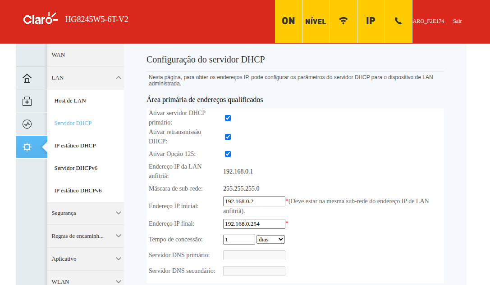
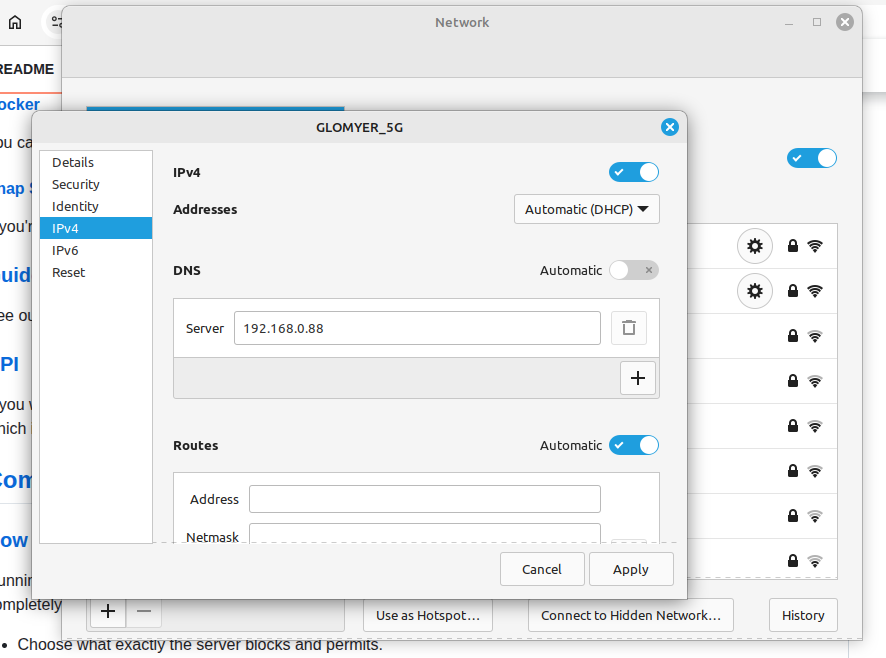
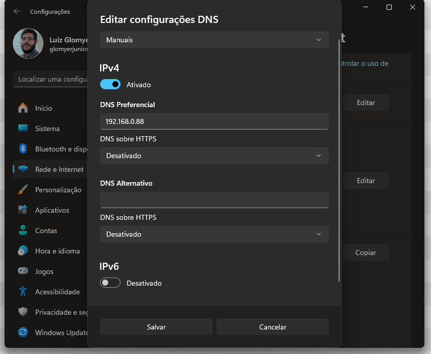
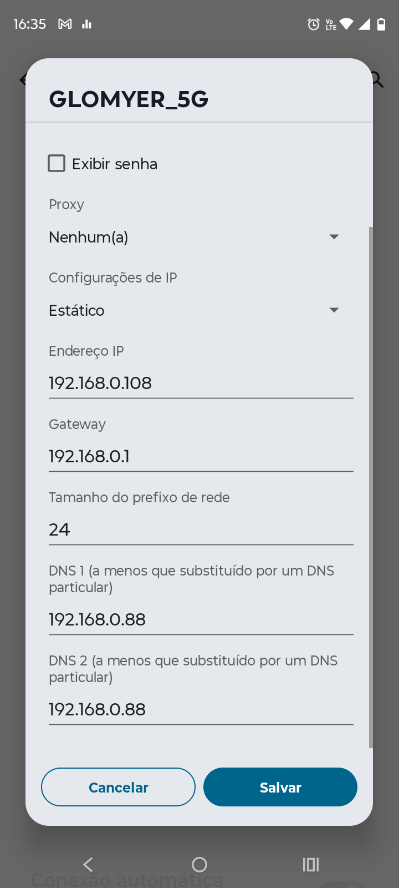
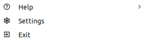

# Adguard Home

Upon the first login you have to add the lists to Adguard's filters. Other useful thing to do is adding custom DNS rules (/#dns_rewrites), the same domains configured in the [Caddyfile](../roles/caddy/templates/Caddyfile.j2).

## Configuring clients

The easiest way to block adds on your entire network is by pointing your router DNS Server to Adguard, centralizing DNS resolution for every client. So, go to http://192.168.0.1/ and find the option to make this change in your router settings. Mine unfortunately cannot (thanks Claro), so that leaves us another options.



For each client you have you will need to manually set the DNS servers. This is a per-connection task. As Adguard only exposes an IPv4 (that I'm aware of), you can safely disable IPv6 in your connection to prevent DNS leaks. Here are some examples on Linux Mint, Windows 11 and Android.

Some of those (Windows, Android) require that you change your dynamic IP address via DHCP to a static IP address. In Linux we can just change the DNS source server.







After that it is a good idea to flush the DNS cache on your machine. Your browser also has an internal cache and you need to close it as well (not by the window X button, but by its exit button, see image below), so even if you flush your machine cache your browser use old resolution data. Terminal commands are below.



```powershell
# On Windows
ipconfig /flushdns
```

```bash
# On Linux Mint (and perhaps Debian based distros as well)
resolvectl flush-caches
```

I had some issues with Android, not all ads are blocked because of DNS leakage. From what I've researched, Android has a internal IPv6 server that cannot be overridden. I have yet to test further this issue in other devices. Nevertheless, you have to disable Private DNS, search your configs and disable it.


## Lists I'm currently using

HaGeZi Multi PRO
https://raw.githubusercontent.com/hagezi/dns-blocklists/main/adblock/pro.txt
Threat Intelligence Feeds
https://raw.githubusercontent.com/hagezi/dns-blocklists/main/adblock/tif.txt
Telemetry block
https://raw.githubusercontent.com/zangadoprojets/pi-hole-blocklist/main/Telemetry.txt


# Useful links

https://github.com/AdguardTeam/AdGuardHome
https://github.com/AdguardTeam/Adguardhome/wiki/Configuration
https://hub.docker.com/r/adguard/adguardhome#configuration
